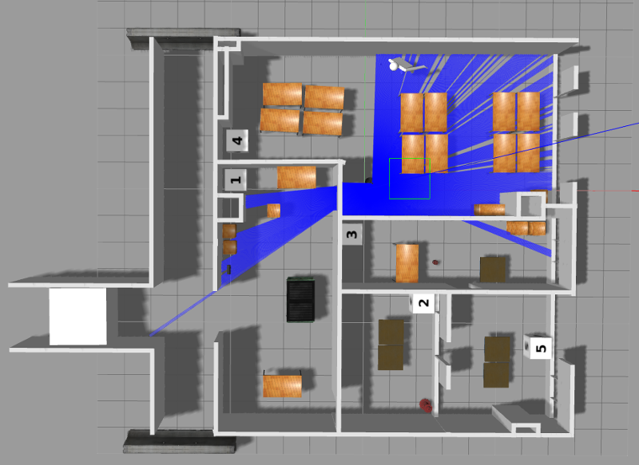

# GMapping 配置调试
## 目的
在 ROS 中使用激光雷达调试 GMapping，深入了解其工作流程及数据处理流程。

## mrobot 小车上调试
mrobot 小车的开发环境为 Ubuntu 14.04 ARM on NVIDIA Jetson TK1。

### Setup Jetson TK1
#### 添加国内的 Ubuntu ARM 源以加快包安装速度。
修改 /etc/apt/sources.list，注释掉之前所有的语句，并添加下列语句。
```shell
deb http://mirrors.ustc.edu.cn/ubuntu-ports/ trusty main multiverse restricted universe
deb http://mirrors.ustc.edu.cn/ubuntu-ports/ trusty-backports main multiverse restricted universe
deb http://mirrors.ustc.edu.cn/ubuntu-ports/ trusty-proposed main multiverse restricted universe
deb http://mirrors.ustc.edu.cn/ubuntu-ports/ trusty-security main multiverse restricted universe
deb http://mirrors.ustc.edu.cn/ubuntu-ports/ trusty-updates main multiverse restricted universe
deb-src http://mirrors.ustc.edu.cn/ubuntu-ports/ trusty main multiverse restricted universe
deb-src http://mirrors.ustc.edu.cn/ubuntu-ports/ trusty-backports main multiverse restricted universe
deb-src http://mirrors.ustc.edu.cn/ubuntu-ports/ trusty-proposed main multiverse restricted universe
deb-src http://mirrors.ustc.edu.cn/ubuntu-ports/ trusty-security main multiverse restricted universe
deb-src http://mirrors.ustc.edu.cn/ubuntu-ports/ trusty-updates main multiverse restricted universe
```

#### System setup
- Do not overwrite "libglx.so".
```shell
sudo apt-get update
sudo apt-mark hold xserver-xorg-core
```

#### Setup Jetson TK1 manually for native-compilation development
- [Jetson/Installing CUDA](http://elinux.org/Jetson/Installing_CUDA)
```shell
$ wget -c http://developer.download.nvidia.com/devzone/devcenter/mobile/jetpack_l4t/005/linux-x64/cuda-repo-l4t-r21.5-6-5-local_6.5-53_armhf.deb
$ sudo dpkg -i cuda-repo-l4t-r21.5-6-5-local_6.5-53_armhf.deb
$ sudo apt-get update
$ sudo apt-get install cuda-toolkit-6-5
```

- [Jetson/Installing OpenCV](http://elinux.org/Jetson/Installing_OpenCV)
```shell
$ wget -c http://developer.download.nvidia.com/devzone/devcenter/mobile/jetpack_l4t/003/linux-x64/libopencv4tegra-repo_2.4.13_armhf_l4t-r21.deb
$ sudo dpkg -i libopencv4tegra-repo_2.4.13_armhf_l4t-r21.deb
$ sudo apt-get install libopencv4tegra libopencv4tegra-dev
```

- 测试安装是否成功
```shell
# 查看 CUDA 版本
$ nvcc -V
```
```shell
# 在 python 中查看 OpenCV4Tegra 版本
$ sudo apt–get install libopencv4tegra–python
$ python
>> import cv2
>> print cv2.__version__
```

#### Setup Jetson TK1 with JetPack for cross-compilation with Ubuntu 14.04 x86_x64
- 首先需要一个 Ubuntu 14.04 64位系统作为 Host；
- 下载 JetPack 包并按照教程 [Download and Install JetPack TK1](http://docs.nvidia.com/jetpack-tk1/1_1/content/developertools/mobile/jetpack_install.htm) 安装。

### Install the Grinch Kernel
This kernel provides many useful drivers that NVidia failed to include with their stock kernel.
```shell
$ git clone https://github.com/jetsonhacks/installGrinch.git
$ cd installGrinch
$ ./installGrinch.sh
```

### 给 Grinch Kernel 打上 UVC 模块补丁
为了解决之后 ros-indigo-librealsense 包 configure 报错，找不到 uvcvideo 模块的问题。虽然实际上我们可能并不会用到 RealSense 的摄像头，但是 ros-indigo-librealsense 为 ros-indigo-turtlebot-bringup 的依赖包。

### Install ROS Indigo
目前仅 ROS Indigo 支持 Ubuntu 14.04 ARM。参考 [Ubuntu ARM install of ROS Indigo](http://wiki.ros.org/indigo/Installation/UbuntuARM)。

```shell
$ sudo update-locale LANG=C LANGUAGE=C LC_ALL=C LC_MESSAGES=POSIX
$ sudo sh -c 'echo "deb http://packages.ros.org/ros/ubuntu trusty main" > /etc/apt/sources.list.d/ros-latest.list'
$ sudo apt-key adv --keyserver hkp://ha.pool.sks-keyservers.net:80 --recv-key 421C365BD9FF1F717815A3895523BAEEB01FA116
```

修改成国内的 ROS 源以加快包安装速度。修改 /etc/apt/sources.list，并添加下列语句。

```shell
sudo sh -c 'echo "deb http://ros.exbot.net/rospackage/ros/ubuntu/ trusty main" >> /etc/apt/sources.list.d/ros-latest.list'
```

```shell
$ sudo apt-get update
$ sudo apt-get install ros-indigo-desktop
$ sudo apt-get install python-rosdep
$ sudo rosdep init
$ rosdep update
# 防止 Rviz 段错误
$ echo "unset GTK_IM_MODULE" >> ~/.bashrc
$ echo "source /opt/ros/indigo/setup.bash" >> ~/.bashrc
$ source ~/.bashrc
$ sudo apt-get install python-rosinstall
$ mkdir -p ~/Workspace/catkin_ws/src
$ cd ~/Workspace/catkin_ws/src
$ catkin_init_workspace
$ cd ~/Workspace/catkin_ws/
$ catkin_make
$ echo "source $HOME/Workspace/catkin_ws/devel/setup.bash" >> ~/.bashrc
$ source ~/.bashrc
$ echo $ROS_PACKAGE_PATH
```
修正 OpenCV4Tegra 的路径

- Files to be modified
```shell
/opt/ros/indigo/lib/pkgconfig/cv_bridge.pc
/opt/ros/indigo/lib/pkgconfig/image_geometry.pc
/opt/ros/indigo/share/cv_bridge/cmake/cv_bridgeConfig.cmake
/opt/ros/indigo/share/image_geometry/cmake/image_geometryConfig.cmake
```
- You can backup and modify each file using the following commands (example for ROS Indigo):
```shell
$ sudo cp /opt/ros/indigo/lib/pkgconfig/cv_bridge.pc /opt/ros/indigo/lib/pkgconfig/cv_bridge.pc-bak
$ sudo cp /opt/ros/indigo/lib/pkgconfig/image_geometry.pc /opt/ros/indigo/lib/pkgconfig/image_geometry.pc-bak
$ sudo cp /opt/ros/indigo/share/cv_bridge/cmake/cv_bridgeConfig.cmake /opt/ros/indigo/share/cv_bridge/cmake/cv_bridgeConfig.cmake-bak
$ sudo cp /opt/ros/indigo/share/image_geometry/cmake/image_geometryConfig.cmake /opt/ros/indigo/share/image_geometry/cmake/image_geometryConfig.cmake-bak
```
- Modifications for each file: (具体可以参考[Hacking for OpenCV on Nvidia Jetson TX1 & Jetson TK1](http://myzharbot.robot-home.it/blog/software/ros-nvidia-jetson-tx1-jetson-tk1-opencv-ultimate-guide/))
     + remove each instance “/usr/lib/arm-linux-gnueabihf/libopencv_ocl.so.2.4.8;“
     + replace each instance of “/usr/lib/arm-linux-gnueabihf/” with “/usr/lib“
     + replace each instance of “2.4.8” with “2.4.13” (or the current version of OpenCV in opencv4tegra package)
```shell
$ sudo sed -i 's/\/arm-linux-gnueabihf//g' /opt/ros/indigo/lib/pkgconfig/cv_bridge.pc /opt/ros/indigo/lib/pkgconfig/image_geometry.pc /opt/ros/indigo/share/cv_bridge/cmake/cv_bridgeConfig.cmake /opt/ros/indigo/share/image_geometry/cmake/image_geometryConfig.cmake
$ sudo sed -i 's/\/usr\/lib\/libopencv_ocl.so.2.4.8 -l://g' /opt/ros/indigo/lib/pkgconfig/cv_bridge.pc /opt/ros/indigo/lib/pkgconfig/image_geometry.pc
$ sudo sed -i 's/\/usr\/lib\/libopencv_ocl.so.2.4.8;//g' /opt/ros/indigo/share/cv_bridge/cmake/cv_bridgeConfig.cmake /opt/ros/indigo/share/image_geometry/cmake/image_geometryConfig.cmake
$ sudo sed -i 's/2.4.8/2.4.13/g' /opt/ros/indigo/lib/pkgconfig/cv_bridge.pc /opt/ros/indigo/lib/pkgconfig/image_geometry.pc /opt/ros/indigo/share/cv_bridge/cmake/cv_bridgeConfig.cmake /opt/ros/indigo/share/image_geometry/cmake/image_geometryConfig.cmake
```

### Setup Hokuyo UST-10LX
- 安装相关包
```shell
$ sudo apt-get install ros-indigo-urg-node
```
- 编辑/etc/network/interfaces，在文件末尾添加一个静态的IP地址。
```shell
auto hukuyo0
allow-hotplug hukuyo0
iface hukuyo0 inet static
      address 192.168.0.20
      netmask 255.255.255.0
```
- 因为Hokuyo激光雷达的出厂设置固定IP地址是“192.168.0.10”，所以在Ubuntu上添加IP地址时，使用“192.168.0.XX”，最后两个数字应该和“10区分”，前面三段和激光雷达的IP一样。
- 将激光雷达连在电脑上，确认连接：
```shell
ping 192.168.0.10
```
- 测试获取激光雷达数据
```shell
$ roscore
$ rosrun urg_node urg_node _ip_address:="192.168.0.10"
$ rostopic echo /scan
```

### (Optional) 设置 RPLidar 激光雷达
- 安装 RPLidar 驱动。
```shell
$ cd ~/catkin_ws/src
$ git clone https://github.com/robopeak/rplidar_ros.git
$ cd ~/catkin_ws
$ catkin_make
``
- 设置 USB 端口用户权限。一般 USB 激光雷达 在 /dev/ttyUSB1 端口。
```shell
$ sudo chmod 666 /dev/ttyUSB1
```
- 需要同时修改 rplidar_ros 包中 rplidar.launch 文件里的 USB 端口号。
- 启动 RPLIDAR 激光雷达。
```shell
$ roslaunch rplidar_ros rplidar.launch
```

### Setup mrobot 开发环境
#### 安装 TurtleBot 包
```shell
$ sudo apt-get install ros-indigo-turtlebot ros-indigo-turtlebot-apps ros-indigo-turtlebot-interactions ros-indigo-kobuki-ftdi ros-indigo-rocon-remocon ros-indigo-rocon-qt-library ros-indigo-ar-track-alvar-msgs
```
这里安装 ros-indigo-librealsense 的时候可能还是会报错，但是不影响安装其他我们需要的包。如果要使用 RealSense Camera，可以参照下面教程重新编译 librealsense 与 realsense-camera。

- [Install librealsense](http://www.jetsonhacks.com/2016/06/20/intel-realsense-camera-installation-nvidia-jetson-tk1/)
- [Install RealSense Camera](http://www.jetsonhacks.com/2016/06/23/realsense-camera-ros-install-jetson-tk1/)

### 设置环境变量
可将下面语句添加到 ~/.bashrc 中。
```shell
export TURTLEBOT_BASE=create
export TURTLEBOT_STACKS=circles
# alternatively kinect
export TURTLEBOT_3D_SENSOR=asus_xtion_pro
# may apear under another ttyUSBn
export TURTLEBOT_SERIAL_PORT=/dev/ttyUSB0
```
### 安装 mrobot
```shell
$ cd ~/catkin_ws/src
$ git clone https://github.com/ROSClub/mrobot-indigo
$ cd mrobot-indigo
$ chmod +x ./mrobot_nav/cfg/CalibrateAngular.cfg ./mrobot_nav/cfg/CalibrateLinear.cfg ./turtlebot_node/cfg/TurtleBot.cfg
$ cd ~/catkin_ws
$ catkin_make
```

### 启动小车
一般 mrobot 在 /dev/ttyUSB0 端口。
```shell
$ roslaunch mrobot_bringup mrobot.launch
```

### 移动测试
```shell
$ roslaunch mrobot_nav keyboard_teleop.launch
```

### 建图测试
- 启动需要的传感器。
```shell
$ roslaunch mrobot_bringup hokuyo.launch
```

- 启动 gmapping
```shell
$ roslaunch mrobot_nav gmapping_demo.launch
```

- 使用 Rviz 观察建图过程。打开 Rviz 后添加显示 /map topic。
```shell
$ rosrun rviz rviz
```

- 保存地图
```shell
$ rosrun map_server map_saver -f your_map_file
```
- 导航测试
关闭之前所有 ROS 节点。重新启动 mrobot 小车、 RPLIDAR 激光雷达后，加载地图
```shell
$ roslaunch mrobot_nav tb_demo_amcl.launch map:=your_map_file
```
- 启动 rviz
```shell
$ rosrun rviz rviz -d `rospack find mrobot_nav`/nav_test.rviz
```

## Ubuntu 14.04 上调试
TBD

### Setup apt source
```shell
deb [arch=amd64,i386] http://mirrors.ustc.edu.cn/ubuntu/ trusty main universe restricted multiverse
deb-src http://mirrors.ustc.edu.cn/ubuntu/ trusty universe multiverse main restricted
deb [arch=armhf] http://mirrors.ustc.edu.cn/ubuntu-ports/ trusty main multiverse restricted universe
deb [arch=armhf] http://mirrors.ustc.edu.cn/ubuntu-ports/ trusty-backports main multiverse restricted universe
deb [arch=armhf] http://mirrors.ustc.edu.cn/ubuntu-ports/ trusty-proposed main multiverse restricted universe
deb [arch=armhf] http://mirrors.ustc.edu.cn/ubuntu-ports/ trusty-security main multiverse restricted universe
deb [arch=armhf] http://mirrors.ustc.edu.cn/ubuntu-ports/ trusty-updates main multiverse restricted universe
deb-src http://mirrors.ustc.edu.cn/ubuntu-ports/ trusty main multiverse restricted universe
deb-src http://mirrors.ustc.edu.cn/ubuntu-ports/ trusty-backports main multiverse restricted universe
deb-src http://mirrors.ustc.edu.cn/ubuntu-ports/ trusty-proposed main multiverse restricted universe
deb-src http://mirrors.ustc.edu.cn/ubuntu-ports/ trusty-security main multiverse restricted universe
deb-src http://mirrors.ustc.edu.cn/ubuntu-ports/ trusty-updates main multiverse restricted universe
```

## Ubuntu 16.04 上调试
### 安装 ROS Kinetic
- 参考 [Ubuntu install of ROS Kinetic](http://wiki.ros.org/kinetic/Installation/Ubuntu)
- 选择 ros-kinetic-desktop-full
```shell
$ sudo apt-get install ros-kinetic-desktop-full
```
- 检查 PYTHONPATH 是否正常
```shell
$ echo $PYTHONPATH
/opt/ros/kinetic/lib/python2.7/dist-packages:/usr/lib/python2.7/plat-x86_64-linux-gnu:/usr/lib/python2.7/lib-tk:/usr/lib/python2.7/lib-old:/usr/lib/python2.7/lib-dynload:/usr/local/lib/python2.7/dist-packages:/usr/lib/python2.7/dist-packages:/usr/lib/python2.7/dist-packages/PILcompat:/usr/lib/python2.7/dist-packages/gtk-2.0
```
- 如果 PYTHONPATH 为空或者仅含 /opt/ros/kinetic/lib/python2.7/dist-packages 则需要使用下面的命令找到 PYTHONPATH 中需要包含的路径
```shell
$ python -c 'import sys; print(sys.path)'
['', '/opt/ros/kinetic/lib/python2.7/dist-packages', '/usr/lib/python2.7', '/usr/lib/python2.7/plat-x86_64-linux-gnu', '/usr/lib/python2.7/lib-tk', '/usr/lib/python2.7/lib-old', '/usr/lib/python2.7/lib-dynload', '/usr/local/lib/python2.7/dist-packages', '/usr/lib/python2.7/dist-packages', '/usr/lib/python2.7/dist-packages/PILcompat', '/usr/lib/python2.7/dist-packages/gtk-2.0']
```
- 在 ～/.bashrc 中加入 PYTHONPATH。注意不要加入 /usr/lib/python2.7，否则 gdb 会报错。
```shell
export PYTHONPATH="${PYTHONPATH}:/usr/lib/python2.7/plat-x86_64-linux-gnu:/usr/lib/python2.7/lib-tk:/usr/lib/python2.7/lib-old:/usr/lib/python2.7/lib-dynload:/usr/local/lib/python2.7/dist-packages:/usr/lib/python2.7/dist-packages:/usr/lib/python2.7/dist-packages/PILcompat:/usr/lib/python2.7/dist-packages/gtk-2.0"
```
- 建议在 ～/.bashrc 中同时加入 ROS setup
```shell
source /opt/ros/kinetic/setup.bash
source $HOME/catkin_ws/devel/setup.bash
```

### (Optional)设置使用镭神 LS01C
#### 安装
- 下载驱动到 $HOME/catkin_ws/src 目录下。驱动位置在 https://192.168.1.2/svn/zxdj_project/0088 项目工作/智能控制组/0092 导航
避障专项/0080 代码开发/0000 slam/talker
- 安装驱动依赖包
```shell
$ rosdep install talker
```
- 编译镭神驱动
```shell
$ cd ~/catkin_ws
$ catkin_make
```
- (Optional) 在雷达连上USB的情况下查看USB端口号。这里结果显示为 usb 3.0 的7号端口（在 Lenovo 台式机上为正面的 USB 2号口）。
```shell
$ udevadm info --attribute-walk --path=/sys/bus/usb-serial/devices/ttyUSB0 | grep "KERNELS==" | head -1
KERNELS=="3-7:1.0"
```
- (Optional) 绑定端口到 /dev/ls01c。修改 talker/config/57-ls01c-desktop.rules 文件中 "KERNELS==" 内容与上面端口号内容一致。然后执行 talker/scripts/create_desktop_rules
```shell
$ chmod +x ~/catkin_ws/src/talker/scripts/create_desktop_rues
$ ~/catkin_ws/src/talker/scripts/create_desktop_rues
```
- (Optional) 然后USB口重新插入雷达。使用下面命令查看雷达是否出现ls01c端口。
```shell
$ ls /dev | grep ls01c
ls01c
```
- 不绑定USB端口的话也是可以的。但是需要使用下面的命令更改 USB 端口权限。并在 talker.launch 里设置 serial_port 为 /dev/ttyUSB0。
```shell
$ sudo chmod 777 /dev/ttyUSB0
```
#### 运行
- 初始化 ROS
```shell
$ roscore
```
- 在新的 Terminal 中
```shell
$ rosrun talker talker.launch
```
- 在rviz中显示数据
```shell
$ roslaunch talker rviz.launch
```
- 可使用 rostopic 查看、接受、发布雷达的 topics
```shell
$ rostopic list
/rosout
/rosout_agg
/scan
/startOrStop
```
- 其中，/scan 为镭神雷达的发布激光数据；
- /startOrStop 用于接收停止雷达数据、电机转动，或者启动转动的命令。消息类型为std_msgs::Int32，消息值为1时停止数据，为2时停止电机，为4时启动扫描。举例如下：
```shell
rostopic pub /startOrStop std_msgs/Int32 "data: 2"
rostopic pub /startOrStop std_msgs/Int32 "data: 4"
```

### GMapping with Fake Odometry Publisher
- 下载 test_odom 到 $HOME/catkin_ws/src 目录下。代码位置在 https://192.168.1.2/svn/zxdj_project/0088 项目工作/智能控制组/0092 导航
避障专项/0080 代码开发/0000 slam/test_odom
- 下载 openslam_gmapping 到 $HOME/catkin_ws/src 目录下。代码位置在 https://192.168.1.2/svn/zxdj_project/0088 项目工作/智能控制组/0092 导航
避障专项/0080 代码开发/0000 slam/openslam_gmapping
- 下载 openslam_gmapping 到 $HOME/catkin_ws/src 目录下。代码位置在 https://192.168.1.2/svn/zxdj_project/0088 项目工作/智能控制组/0092 导航
避障专项/0000  slam开源代码/slam_gmapping
- 编译这些包
```shell
$ cd ~/catkin_ws
$ catkin_make
```
- 运行
```shell
# After launching a laser sensor...
$ roslaunch test_odom test.launch
$ rosrun gmapping slam_gmapping scan:=scan
```
- 使用 Rviz 观察建图过程。打开 Rviz 后添加显示 /map topic。
```shell
$ rosrun rviz rviz
```

## Gazebo 模拟器上调试
### 安装 Gazobo 模拟器
- Install with ROS
```shell
$ sudo apt-get install ros-kinetic-gazebo-ros ros-kinetic-gazebo-ros-pkgs ros-kinetic-gazebo-ros-control
```
- Or install the latest version (Untested)
```shell
$ curl -ssL http://get.gazebosim.org | sh
```
- Install all the models manually。Gazebo 原本的设定是用到某个模型的时候再去下载到本地，由于其服务器下载速度缓慢，会严重影响开发速度。所以我们要预先把模型都下载好。
- 下载 https://192.168.1.2/svn/zxdj_project/0088 项目工作/智能控制组/0092 导航
避障专项/0080 代码开发/0000 slam/gazebo_models 文件夹到本地任意目录后，执行下列命令安装。
```shell
cd gazebo_models
chmod +x install
mkdir -p ~/.gazebo/models
./install
```

### TurtleBot with Gazebo
- Installation
```shell
$ sudo apt-get install ros-kinetic-turtlebot ros-kinetic-turtlebot-apps ros-kinetic-turtlebot-interactions ros-kinetic-turtlebot-simulator ros-kinetic-kobuki-ftdi  ros-kinetic-ar-track-alvar-msgs ros-kinetic-turtlebot-gazebo ros-kinetic-turtlebot-rviz-launchers
```

- The following command starts the turtlebot in the simulated world.
```shell
$ roslaunch turtlebot_gazebo turtlebot_world.launch
```
- 控制 turtlebot 移动
```shell
$ roslaunch turtlebot_teleop keyboard_teleop.launch
```
- Mapping within Gazebo
```shell
$ roslaunch turtlebot_gazebo gmapping_demo.launch
```
- Use RViz to visualize the map building process
```shell
$ roslaunch turtlebot_rviz_launchers view_navigation.launch
```
- Save the map to disk
```shell
$ rosrun map_server map_saver -f <your map name>
```
- Frontier exploration and navigation
```shell
$ cd ~/catkin_ws/src
$ git clone https://github.com/bnurbekov/Turtlebot_Navigation.git
$ cd ~/catkin_ws
$ catkin_make
$ roslaunch turtlebot_gazebo turtlebot_world.launch
```
- 使用 Rviz 观察建图过程。打开 Rviz 后，在 Rviz 中打开 Turtlebot_Navigation/rviz/final.rviz。
```shell
$ rosrun rviz rviz
$ roslaunch final_project final_project.launch
$ rosrun final_project mapping.py
$ rosrun final_project control.py
```

### 进阶 Gazebo 调试环境搭建
- 下载 https://192.168.1.2/svn/zxdj_project/0088 项目工作/智能控制组/0092 导航
避障专项/0080 代码开发/0000 slam/test_slam_sim 到本地 ROS 工作目录中。默认为 ~/catkin_ws/src 文件夹下。
```shell
cd ~/catkin_ws
catkin_make
```
- 运行 Gazebo 模拟环境
```shell
roslaunch test_slam_sim oriental_world.launch
```
效果如图所示：



- 运行 GMapping 并移动机器人建图
```shell
roslaunch test_slam_sim gmapping.launch
roslaunch turtlebot_teleop keyboard_teleop.launch
```

- 该模拟环境默认集成了里程计，Hokuyo 雷达，Kinect 和 IMU。

### 使用 rosbag 录制和重播评估机环境
- 使用 rosbag 录制 rostopic。在评估机上执行下列命令：
```shell
$ roslaunch mrobot_bringup mrobot.launch
$ roslaunch mrobot_bringup hokuyo.launch
$ rosbag record -a
```
- 使用遥控器移动小车收集传感器信息。完成后 Ctrl-C 关闭 rosbag recording。
- 将 rosbag 文件：*.bag 复制到开发主机上后，可用下列命令运行 GMapping：
```shell
$ roscore
$ rosbag play --clock 2017-04-01-09-45-44.bag
$ roslaunch test_slam_sim gmapping.launch
```
- 目前已录制好一份办公室Hokuyo激光雷达+mrobot里程计的rosbag。放在 test_slam_sim/bagfiles 目录下。

## 参考文献
1. [TurtleBot - Make a map and navigate with it](http://wiki.ros.org/turtlebot_gazebo/Tutorials/indigo/Make%20a%20map%20and%20navigate%20with%20it)
