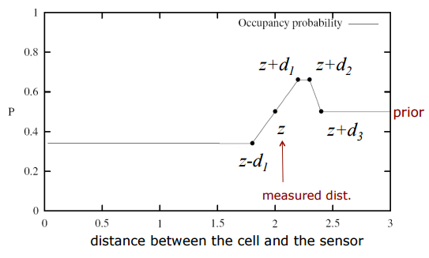
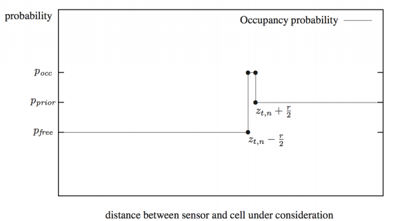
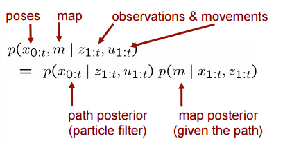
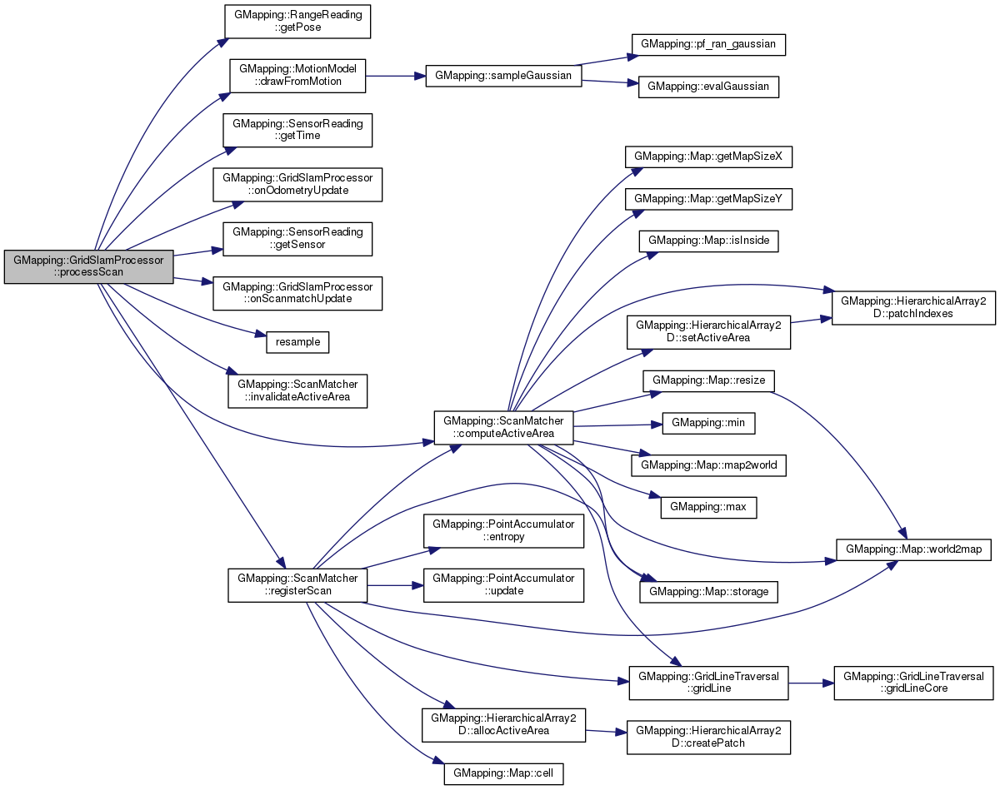

# GMapping 专项分析
## 文档概述
### 目的
基于开源 GMapping 代码，分析其原理，为改进这一算法打下基础。

### 范围
针对 GMapping 开源代码，从以下方面对其各个模块进行分析：

- 算法原理；
- 代码实现；
- 参数统计。

## GMapping 概述
GMapping 是一个高效的 Rao-Blackwellized particle filer (RBPF) 实现[1]。在 GMapping 中，每一个粒子会独立生成一个环境地图。因此，此算法的关键是用尽可能少的粒子来绘图，从而提升算法效率。GMapping 作者提出，在算法中结合器人近期位置信息，可以在机器人位置预测步骤中极大地减少不确定性。此外，选择性地执行重新采样的操作也可以有效地减小粒子退化的问题。

### 硬件设备
- 激光雷达，长距（>20m）短距（10m左右）都适用。GMapping 默认参数是根据 SICK LMS or PLS scanner 之类的长距雷达优化的。
- 里程计

### 输入数据
- 原始激光距离数据
- 机器人位置转向数据

## 算法原理
首先根据 Rao-Blackwellized Particle Filter 这一 GMapping 核心算法的发展顺序，由浅入深地来介绍一下如何使用 RBPF 完成 SLAM 。之后，再介绍 GMapping 的具体在 RBPF 的基础上做了哪些改进。

### Grid Maps
Grid Maps 建立了三个假设，来把地图表示成一个概率模型。

- 首先，地图被分割成一系列 2D 方格，用被占领的概率来表示方格上是否有物体存在。其中，$ i $ 方格如果被占领了表示为 $ p(m_i) = 1 $ ，未被占领表示为 $ p(m_i) = 0 $ 。如果不知道格子有没有被占领，则表示为 $ p(m_i) = 0.5$ ，也就是说这一格上有障碍物的可能性是一半一半。
- 其次，算法假定地图上的障碍物都是永远是静止的。也就是说如果方格 $ i $  的占领状态为 $ p(m_i) = 1 $ ，那么之后所有时刻$ i $ 方格的状态都是 $ p(m_i) = 1 $ 。
- 第三，方格之间被占领的概率是互相独立的。因此，整个地图的概率分布可以表示为 $p(m) = \prod\limits_i{p(m_i)}$ 。

对于机器人来说，这一时刻地图上方格的被占概率大小受到传感器的输入 $ z_{1:t} $  和机器人自身位置 $ x_{1:t} $  的影响（这里假设机器人是知道自己位置的）。因为地图状态是静止的，这一时刻地图上的障碍物分布概率如果仅跟上一时刻地图状态有关的话，可以根据贝叶斯滤波来估算。通常为了计算方便，整个计算在 $ \log $  域进行。最后可表示为 $ l(m_i | z_{1:t},x_{1:t}) = l(m_i | z_t, x_t) + l(m_i | z_{1:t-1},x_{1:t-1}) - l(m_i) $ 。其中,

- 第一部分为传感器相关的反感知模型(Inverse Sensor Model)，比如：
    + 一般声纳传感器的模型为
      

    + 一般激光传感器的模型为
      

- 第二部分为上一时刻系统在各种因素影响下的状态；
- 第三部分为到上一时刻为止的方格 $ i $  的状态。

在现实世界中，机器人自身的移动往往带有很多的噪声，传感器数据相对精确，但需要对数据进行适当的处理。

### Scan-matching
扫描匹配是用来将当前传感器数据跟之前累计的传感器数据，或者当前传感器数据跟之前的地图数据进行匹配，从而达到用较为精确的传感器数据修正相对模糊的机器人位置数据的目的。扫描匹配的方法有很多，有 Iterative closest point (ICP)，scan-to-scan， scan-to-map，map-to-map，feature-based 等等。原则上使用任意一种都是可行的。

### Particle Filter
粒子滤波用来处理环境中无规则的概率分布的问题，主要通过多重采样来探知一个区域的概率分布。一般先用一个已知的建议分布（如平均分布、正态分布，或者与机器人动作、传感器特点相关的分布等），将得到的样本除以初始分布的预测样本，得到一个权值分布。再根据新的权值分布，进行重新采样（权重大的地方附近就相对多采样等）。将这个过程重复数次，从而使得整个预测的分布可以逼近实际障碍物分布。Particle Filter 的改进或者变种算法主要是对其两个地方进行优化。一是选择适当的采样建议分布（Proposal Distribution）；二是重采样方法的选择（有重要性、蒙特卡罗等多种采样方法）。

### Rao-Blackwellized Particle Filter
RBPF 主要是通过因式分解，把 SLAM 求概率的问题转化成：


如果机器人位置信息已知，计算 $ p(m|x_{1:t}, z_{1:t}) $ 就会比较容易。于是 SLAM 的重点就归结到计算 $ p(x_{0:t} | z_{1:t}, u_{1:t}) $。 应用 Particle Filter：

- 每个粒子代表机器人可能的轨迹；
- 每个粒子保持一个自己的地图；
- 每个粒子根据自己的位置信息更新地图。

### GMapping
GMapping 在 RBPF 的基础上做了两点改进：

- 从最新的传感器数据跟与之最匹配的机器人位置中计算出建议分布（proposal distribution）。由此，地图将会更精确；累计误差减少，算法需要的粒子数也可以降低。
- 使用了一种适应性的重采样技巧，以解决粒子退化问题，保证了粒子群的多样性。

算法步骤如下：

1. 机器人假设的当前位置信息通过粒子 $ i $  可表示为 $x_t'^{(i)} = x_{t-1}^{(i)} \bigoplus u_{t-1}$ 。其中，$ x_{t-1}^{(i)} $  为上一时刻机器人位置信息；$ u_{t-1} $  为上一时刻里程计读数。
2. 扫描匹配算法将围绕 $ x_t'^{(i)} $  的一块有限区域与上一时刻的粒子 $ i $  的地图 $ m_{t-1}^{(i)} $  进行匹配。如果没有发现匹配区域，跳过步骤 3 和 4，改为用运动模型 (motion model) 来计算机器人位置与权重。
3. 根据假设位置 $\hat{x}_t^{(i)}$  设定一个区间，中选出一系列采样点。通过评估每一对采样点在采样位置 $ x_j $  的目标分布 $  p(z_t | m_{t-1}^{(i)}, x_j)p(x_j | x_{t-1}^{(i)}, u_{t-1}) $ ，可以得到建议分布的平均数和协方差矩阵。同时，算出权重因子。
4. 新的粒子 $ i $  的位置 $ x_t^{i} $  根据高斯近似 $N(u_t^{(i)}, \sum_t^{(i)})$  从改进的建议分布中选出。
5. 更新重要权重。
6. 根据位置信息 $ x_t^{(i)} $  与传感器观察 $ z_t $  ，更新粒子 $ i $  的地图 $ m^{(i)} $  。
7. 应用 $n_{eff} = \frac{1}{\sum_i (w_t^{[i]})^2}$ 来衡量估计分布与目标分布之间的相似度。仅当 $ n_{eff} $ 小于一个临界值时（比如粒子总数量的一半 $ N/2 $），才进行重新采样。

## 代码分析
slam_gmapping 对 openslam_gmapping 进行了封装。本节以 slam_gmapping 对 openslam_gmapping 各类及接口的调用为线索，重点阐述 gmapping 算法相关代码的工作流程。

### 流程概述
1. 初始化 SlamGMapping::init()
   + GMapping::GridSlamProcessor()
   + 设置各种初始参数（详见参数统计）
2. 启动 SlamGMapping::startLiveSlam()，对注册了一些回调函数及服务
   + 用于显示地图的 "dynamic_map" 与 SlamGMapping::mapCallback。
   + 当 sensor_msgs::LaserScan 回调 SlamGMapping::laserCallback。
3. 当收到激光扫描数据后，回调 SlamGMapping::laserCallback
   + 在得到第一次 laser scan 后初始化绘图器 SlamGMapping::initMapper
     - 初始化各种 ROS 到 GMapping 的坐标转换；
     - GMapping 相关的初始化，包括 GMapping::RangeSensor，GMapping::SensorMap，GridSlamProcessor 各种初始参数设置，GMapping::sampleGaussian。（[详见 SlamGMapping::initMapper](#SlamGMapping::initMapper)）
   + 处理激光扫描数据 SlamGMapping::addScan
     - 将 ROS 传感器输入等数据转换成 GMapping 格式；
     - 调用 GMapping 相关函数进行处理。（[详见 SlamGMapping::addScan](#SlamGMapping::addScan)）
   + 更新地图 SlamGMapping::updateMap
     - 调用 GMapping::ScanMatcher；（[详见 SlamGMapping::updateMap](#SlamGMapping::updateMap)）
     - 计算系统熵 SlamGMapping::computePoseEntropy，用以显示算法表现。

### 重点代码片段详解
#### SlamGMapping::initMapper
初始化各种参数，初始化地图等。

```cpp
gsp_laser_ = new GMapping::RangeSensor("FLASER",
                                      gsp_laser_beam_count_,
                                      fabs(scan.angle_increment),
                                      gmap_pose,
                                      0.0,
                                      maxRange_);

//......//

gsp_odom_ = new GMapping::OdometrySensor(odom_frame_);

//......//
```
#### SlamGMapping::addScan
激光传感器数据处理相关函数。

```cpp
GMapping::RangeReading reading(scan.ranges.size(),
                               ranges_double,
                               gsp_laser_,
                               scan.header.stamp.toSec());

//......//

return gsp_->processScan(reading);
```

#### GridSlamProcessor::processScan
GMapping 算法主要核心函数。



```cpp
bool GridSlamProcessor::processScan(const RangeReading & reading, int adaptParticles){

        /**retireve the position from the reading, and compute the odometry*/
        OrientedPoint relPose=reading.getPose();
        if (!m_count) {
                m_lastPartPose=m_odoPose=relPose;
        }

        //write the state of the reading and update all the particles using the motion model
        for (ParticleVector::iterator it=m_particles.begin(); it!=m_particles.end(); it++) {
                OrientedPoint& pose(it->pose);
                pose=m_motionModel.drawFromMotion(it->pose, relPose, m_odoPose);
        }

        //......//

        //invoke the callback
        onOdometryUpdate();

        // accumulate the robot translation and rotation
        OrientedPoint move=relPose-m_odoPose;
        move.theta=atan2(sin(move.theta), cos(move.theta));
        m_linearDistance+=sqrt(move*move);
        m_angularDistance+=fabs(move.theta);

        //......//

        m_odoPose=relPose;

        bool processed=false;

        // process a scan only if the robot has traveled a given distance or a certain amount of time has elapsed
        if (!m_count
            || m_linearDistance>=m_linearThresholdDistance
            || m_angularDistance>=m_angularThresholdDistance
            || (period_ >= 0.0 && (reading.getTime() - last_update_time_) > period_)) {
                last_update_time_ = reading.getTime();

                //......//

                //this is for converting the reading in a scan-matcher feedable form
                assert(reading.size()==m_beams);
                double * plainReading = new double[m_beams];
                for(unsigned int i=0; i<m_beams; i++) {
                        plainReading[i]=reading[i];
                }
                m_infoStream << "m_count " << m_count << endl;

                RangeReading* reading_copy =
                        new RangeReading(reading.size(),
                                         &(reading[0]),
                                         static_cast<const RangeSensor*>(reading.getSensor()),
                                         reading.getTime());

                if (m_count>0) {
                        scanMatch(plainReading);
                        if (m_outputStream.is_open()) {

                                //......//

                                for (RangeReading::const_iterator b=reading.begin(); b!=reading.end(); b++) {
                                        m_outputStream << *b << " ";
                                }
                                OrientedPoint p=reading.getPose();

                                //......//

                                for (ParticleVector::const_iterator it=m_particles.begin(); it!=m_particles.end(); it++) {
                                        const OrientedPoint& pose=it->pose;
                                        //......//
                                }
                        }
                        onScanmatchUpdate();

                        updateTreeWeights(false);

                        resample(plainReading, adaptParticles, reading_copy);

                } else {
                        for (ParticleVector::iterator it=m_particles.begin(); it!=m_particles.end(); it++) {
                                m_matcher.invalidateActiveArea();
                                m_matcher.computeActiveArea(it->map, it->pose, plainReading);
                                m_matcher.registerScan(it->map, it->pose, plainReading);

                                // cyr: not needed anymore, particles refer to the root in the beginning!
                                TNode* node=new TNode(it->pose, 0., it->node,  0);
                                //node->reading=0;
                                node->reading = reading_copy;
                                it->node=node;

                        }
                }

                delete [] plainReading;
                m_lastPartPose=m_odoPose; //update the past pose for the next iteration
                m_linearDistance=0;
                m_angularDistance=0;
                m_count++;
                processed=true;

                //keep ready for the next step
                for (ParticleVector::iterator it=m_particles.begin(); it!=m_particles.end(); it++) {
                        it->previousPose=it->pose;
                }

        }
        if (m_outputStream.is_open())
                m_outputStream << flush;
        m_readingCount++;
        return processed;
}
```

#### SlamGMapping::updateMap
扫描匹配相关代码。

```cpp
GMapping::ScanMatcher matcher;

//......//

GMapping::ScanMatcherMap smap(center, xmin_, ymin_, xmax_, ymax_,
                              delta_);

//......//

  matcher.invalidateActiveArea();
  matcher.computeActiveArea(smap, n->pose, &((*n->reading)[0]));
  matcher.registerScan(smap, n->pose, &((*n->reading)[0]));

//......//
```

## 参数统计

### Parameters used by GMapping:

Laser Parameters:

- maxRange: [double] maximum range of the laser scans. Rays beyond this range get discarded completely. (default: maximum laser range minus 1 cm, as received in the the first LaserScan message)
- maxUrange: [double] maximum range of the laser scanner that is used for map building (default: same as maxRange)
- sigma: [double] standard deviation for the scan matching process (cell)
- kernelSize: [int] search window for the scan matching process
- lstep: [double] initial search step for scan matching (linear)
- astep: [double] initial search step for scan matching (angular)
- iterations: [int] number of refinement steps in the scan matching. The final "precision" for the match is lstep*2^(-iterations) or astep*2^(-iterations), respectively.
- lsigma: [double] standard deviation for the scan matching process (single laser beam)
- ogain: [double] gain for smoothing the likelihood
- lskip: [int] take only every (n+1)th laser ray for computing a match (0 = take all rays)
- minimumScore: [double] minimum score for considering the outcome of the scanmatching good. Can avoid 'jumping' pose estimates in large open spaces when using laser scanners with limited range (e.g. 5m). (0 = default. Scores go up to 600+, try 50 for example when experiencing 'jumping' estimate issues)

Motion Model Parameters (all standard deviations of a gaussian noise model):

-  srr: [double] linear noise component (x and y)
-  stt: [double] angular noise component (theta)
-  srt: [double] linear -> angular noise component
-  str: [double] angular -> linear noise component

Others:

-  linearUpdate: [double] the robot only processes new measurements if the robot has moved at least this many meters
-  angularUpdate: [double] the robot only processes new measurements if the robot has turned at least this many rads
-  resampleThreshold: [double] threshold at which the particles get resampled. Higher means more frequent resampling.
-  particles: [int] (fixed) number of particles. Each particle represents a possible trajectory that the robot has traveled

Likelihood sampling (used in scan matching):

-  llsamplerange: [double] linear range
-  lasamplerange: [double] linear step size
-  llsamplestep: [double] linear range
-  lasamplestep: [double] angular step size

Initial map dimensions and resolution:

-  xmin: [double] minimum x position in the map [m]
-  ymin: [double] minimum y position in the map [m]
-  xmax: [double] maximum x position in the map [m]
-  ymax: [double] maximum y position in the map [m]
-  delta: [double] size of one pixel [m]

### Parameters used by our GMapping wrapper:

- throttle_scans: [int] throw away every nth laser scan
- base_frame: [string] the tf frame_id to use for the robot base pose
- map_frame: [string] the tf frame_id where the robot pose on the map is published
- odom_frame: [string] the tf frame_id from which odometry is read
- map_update_interval: [double] time in seconds between two recalculations of the map

## 结论

## 遗留问题

## 参考文献
1. OpenSLAM GMapping (https://www.openslam.org/gmapping.html)
2. Giorgio Grisetti, Cyrill Stachniss, and Wolfram Burgard: Improved Techniques for Grid Mapping with Rao-Blackwellized Particle Filters, IEEE Transactions on Robotics, Volume 23, pages 34-46, 2007 (http://www.informatik.uni-freiburg.de/~stachnis/pdf/grisetti07tro.pdf)
3. Giorgio Grisetti, Cyrill Stachniss, and Wolfram Burgard: Improving Grid-based SLAM with Rao-Blackwellized Particle Filters by Adaptive Proposals and Selective Resampling, In Proc. of the IEEE International Conference on Robotics and Automation (ICRA), 2005 (http://www.informatik.uni-freiburg.de/~stachnis/pdf/grisetti05icra.pdf)

## 附录
1. GMapping 开源代码
2. GMapping 源代码 doxygen 文档
