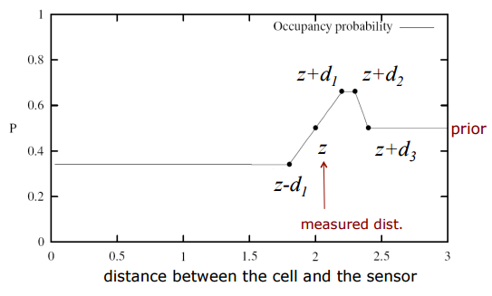
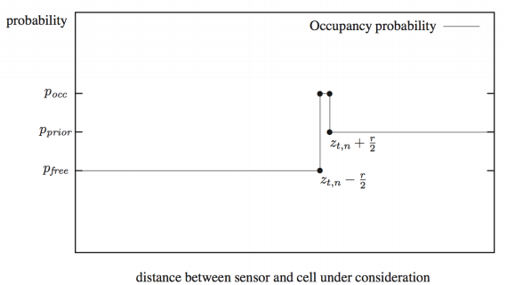

# GMapping 专项分析
## 文档概述
### 目的
基于开源 GMapping 代码，分析其原理，为改进这一算法打下基础。

### 范围
针对 GMapping 开源代码，从以下方面对其各个模块进行分析：
- 数学模型；
- 代码实现。

## GMapping 概述
GMapping 是一个高效的 Rao-Blackwellized particle filer (RBPF) 实现[1]。在 GMapping 中，每一个粒子会独立生成一个环境地图。因此，此算法的关键是用尽可能少的粒子来绘图，从而提升算法效率。GMapping 作者提出，在算法中结合器人近期位置信息，可以在机器人位置预测步骤中极大地减少不确定性。此外，选择性地执行重新采样的操作也可以有效地减小粒子退化的问题。

### 硬件设备
- 激光雷达，长距（>20m）短距（10m左右）都适用。GMapping 默认参数是根据 SICK LMS or PLS scanner 之类的长距雷达优化的。
- 里程计

### 输入数据
- 原始激光距离数据
- 机器人位置转向数据

## 算法背景知识
首先根据 Rao-Blackwellized Particle Filter 这一 GMapping 核心算法的发展顺序，由浅入深地来介绍一下如何使用 RBPF 完成 SLAM 。之后，再介绍 GMapping 的具体在 RBPF 的基础上做了哪些改进。

### Grid Maps
Grid Maps 建立了三个假设，来把地图表示成一个概率模型。

- 首先，地图被分割成一系列 2D 方格，用被占领的概率来表示方格上是否有物体存在。其中，$i$ 方格如果被占领了表示为  $p(m_i) = 1$，未被占领表示为 $p(m_i) = 0$。如果不知道格子有没有被占领，则表示为 $p(m_i) = 0.5$，也就是说这一格上有障碍物的可能性是一半一半。
- 其次，算法假定地图上的障碍物都是永远是静止的。也就是说如果方格 $i$ 的占领状态为 $p(m_i) = 1$，那么之后所有时刻$i$方格的状态都是 $p(m_i) = 1$。
- 第三，方格之间被占领的概率是互相独立的。因此，整个地图的概率分布可以表示为 $p(m) = \prod\limits_i{p(m_i)}$。

对于机器人来说，这一时刻地图上方格的被占概率大小受到传感器的输入 $z_{1:t}$ 和机器人自身位置 $x_{1:t}$ 的影响。因为地图状态是静止的，这一时刻地图上的障碍物分布概率如果仅跟上一时刻地图状态有关的话，可以根据贝叶斯滤波来估算。通常为了计算方便，整个计算在 $\log$ 域进行。最后可表示为 $l(m_i | z_{1:t},x_{1:t}) = l(m_i | z_t, x_t) + l(m_i | z_{1:t-1},x_{1:t-1}) - l(m_i)$。其中,

- 第一部分为传感器相关的反感知模型(Inverse Sensor Model)，比如：
    + 一般声纳传感器的模型为
      

    + 一般激光传感器的模型为
      

- 第二部分为上一时刻系统在各种因素影响下的状态；
- 第三部分为到上一时刻为止的方格 $i$ 的状态。

在现实世界中，机器人自身的移动往往带有很多的噪声，传感器数据相对精确，但需要对数据进行适当的处理。

### Particle Filter
粒子滤波用来处理环境中无规则的概率分布的问题。主要通过多重采样来探知一个区域的概率分布。一般采样时用一个已知分布（如平均分布、正态分布等），将得到的样本除以初始分布的预测样本，得到一个权值分布。再根据新的权值分布，进行重新采样。

### Rao-Blackwellized Particle Filter

## 代码分析

## 参数统计

## 结论

## 遗留问题

## 参考文献
1. OpenSLAM GMapping (https://www.openslam.org/gmapping.html)
2. Giorgio Grisetti, Cyrill Stachniss, and Wolfram Burgard: Improved Techniques for Grid Mapping with Rao-Blackwellized Particle Filters, IEEE Transactions on Robotics, Volume 23, pages 34-46, 2007 (http://www.informatik.uni-freiburg.de/~stachnis/pdf/grisetti07tro.pdf)
3. Giorgio Grisetti, Cyrill Stachniss, and Wolfram Burgard: Improving Grid-based SLAM with Rao-Blackwellized Particle Filters by Adaptive Proposals and Selective Resampling, In Proc. of the IEEE International Conference on Robotics and Automation (ICRA), 2005 (http://www.informatik.uni-freiburg.de/~stachnis/pdf/grisetti05icra.pdf)

## 附录
1. GMapping 开源代码注解版
2.
