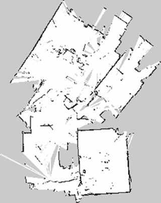

# SLAM 算法设计篇
## 目的
在[Jetson TK1 + ROS + GMapping + Hokuyo UST-10LX + Odometry]的基础上，使室内 SLAM 达到以下指标：

- 1. 构建出完整的办公区域室内地图。地图精度达到 3 cm。
     + 北阳雷达精度为 [ 9 mm - 88 mm]（$2\sin(0.25\pi/180)$ × [0.06 - 10] m $\pm$ 40 mm）。
- 2. 要达到 1 中的精度，最大建图半径为 3m 。瞬时建图区域以机器人为中心，为前方 270$^{\circ}$ 的扇形区域。约计 28 $m^2$ 。
- 3. 所建地图轮廓清楚，总是可以识别场景主要特征，可以闭环。
- 4. 建图具有一定的鲁棒性。建图过程不受里程计的绕动影响。
     + 绕动包括轮子打滑，机器人被举起等情况。
- 5. TBD

## 问题分析
目前 SLAM 所用的 GMapping 效果图如下：



- 地图有许多零碎的未知区域，没有建图。
    + 可能建图时没有扫描到这些区域；
    + GMapping 没有及时对这些区域作出正确的判断。
- 地图边缘不连贯，轮廓误差明显。
    + GMapping 参数设置未能符合北阳雷达性能；
    + 环境对于传感器的干扰。
- 地图上一些地标性物体不能准确辨认，如桌椅门窗等。
    + GMapping 没有对 2D 地图进一步提取特征的能力；
    + 对于较远处物体，雷达精度未能达到识别要求。
- 建图过程会发生地图整体偏移。
    + GMapping 建议分布对里程计度数依赖较大。

## SLAM 改进建议
### 参数调整
- 针对机器人配置及运行环境，人工调整 GMapping 参数。
- 引入动态参数调整机制。
    + 重构 GMapping 代码，使其可以动态配置主要参数；
    + 编写建图评估模块，实时评估建图效果；
    + 引入HMM或遗传算法或者神经网络模块，实时动态调整参数。

### 引入 2D 地图特征识别
- 在扫描匹配中加入地图特征识别，构建地标来提高扫描匹配的精度；
- 2D 图片识别可以用 OpenCV 中支持的方法；
- 可以考虑用卷积神经网络从粒子地图中提取地图特征。

## 实验
### 人工参数调整 (0.5 Day)
目前 mrobot-indigo/mrobot_nav/launch/gmapping.launch 参数调整如下：
```xml
<launch>

  <arg name="scan_topic" default="scan" />

  <node pkg="gmapping" type="slam_gmapping" name="slam_gmapping" output="screen" clear_params="true">
    <param name="odom_frame" value="odom"/>
    <param name="map_update_interval" value="30.0"/>

    <!-- number of particles -->
    <param name="particles" value="30"/>

    <!-- measurement integration -->
    <param name="angularUpdate" value="0.5"/>
    <param name="linearUpdate" value="1"/>
    <param name="temporalUpdate" value="-1.0"/>

    <!-- map resolution -->
    <param name="delta" value="0.05"/>

    <!-- scan matcher -->
    <!-- maximum valid range of the Laser -->
    <param name="maxRange" value="10.0"/>
    <!-- use up to range of the Laser -->
    <param name="maxUrange" value="10.0"/>
    <!-- scan matcher cell sigma, for the greedy search -->
    <param name="sigma" value="0.075"/>
    <param name="iterations" value="5"/>

    <!-- ## default settings for a 0.1 m map cell -->
    <!-- linear search step (choose delta) -->
    <param name="lstep" value="0.1"/>
    <!-- angular search step, this is fine, depending on the odometry error and the update interval -->
    <param name="astep" value="0.05"/>
    <!-- sigma likelihood of 1 beam -->
    <param name="lsigma" value="0.1"/>
    <!-- beams to skip in the likelihood computation -->
    <param name="lskip" value="0"/>

    <!-- the higher the value the slower the filter, the better it can deal with noise, but the less precise and slower -->
    <param name="kernelSize" value="1"/>
    <!-- gain for smoothing the likelihood -->
    <param name="ogain" value="3.0"/>
    <!-- when neff  is below this value a resampling occurs -->
    <param name="resampleThreshold" value="0.5"/>

    <!-- likelihood sampling -->
    <!-- linear range -->
    <param name="llsamplerange" value="0.01"/>
    <!-- linear step -->
    <param name="llsamplestep" value="0.01"/>
    <!-- angular range -->
    <param name="lasamplerange" value="0.005"/>
    <!-- angular step -->
    <param name="lasamplestep" value="0.005"/>

    <!-- motion model parameters -->
    <!-- translation as a function of translation -->
    <param name="srr" value="0.01"/>
    <!-- translation as a function of rotation -->
    <param name="srt" value="0.01"/>
    <!-- rotation as a function of translation -->
    <param name="str" value="0.01"/>
    <!-- rotation as a function of rotation -->
    <param name="stt" value="0.01"/>

    <!--
      inital map params
      <param name="xmin" value="-50.0"/>
      <param name="ymin" value="-50.0"/>
      <param name="xmax" value="50.0"/>
      <param name="ymax" value="50.0"/>
      make the starting size small for the benefit of the Android client's memory...
    -->
    <param name="xmin" value="-1.0"/>
    <param name="ymin" value="-1.0"/>
    <param name="xmax" value="1.0"/>
    <param name="ymax" value="1.0"/>

    <remap from="scan" to="$(arg scan_topic)"/>
  </node>
</launch>
```
建图效果如下：


评估机大致轨迹（手绘）如下：


经过参数调整后，整个 SLAM 效果有显著进步。

- 本次操作较为谨慎，已基本消灭了之前地图上出现的零碎未知区域。目前存在的位置区域都可以断定是障碍物遮挡所致。
- 整体地图轮廓连贯。
- 地图上的主要障碍物及地标都能有所发现。

### 基于 OpenCV 的 2D 地图特征提取 (2 Day)

### GMapping 重构 (3 Day)

### 安装 TensorFlow (1.5 Day)

### 实现实时动态参数调整 (5 Day)

### 实现 CNN 地图特征提取匹配 (10 Day)
